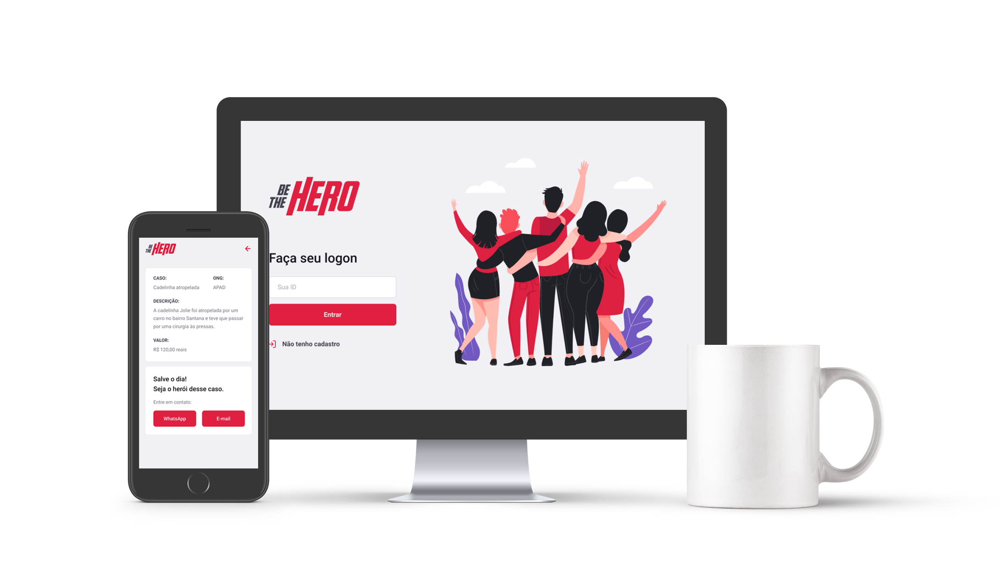

<h1 align="center">
    Be The Hero
</h1>

 

  

## Tecnologias
Esse projeto foi desenvolvido com as seguintes tecnologias:

- [Node.js](https://nodejs.org/en/ "Node.js")
- [React](https://reactjs.org/ "React")
- [React Native](https://facebook.github.io/react-native/ "React Native")
- [Expo](https://expo.io/ "Expo")

## Projeto

Código da aplicação desenvolvida durante a Semana OmniStack 11.0 da [Rocketseat](https://rocketseat.com.br "Rocketseat"). O BeTheHero é um projeto que visa conectar pessoas que desejam fazer contribuições monetárias a ONG's (Organizações não governamentais) que precisam de ajuda.

---